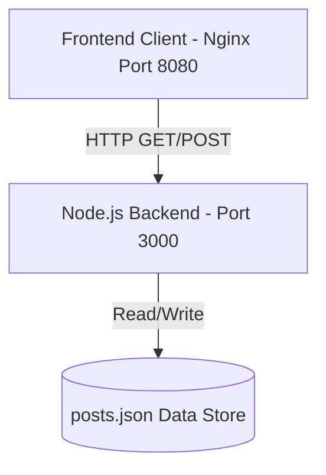

# FEWD-PROJECT

An advanced full-stack web application meticulously restructured to embody continuous improvement, automation with a human touch, and simplicity.

## Architecture



## Setup & Deployment

To spin up the entire application locally, you only need Docker and Docker Compose.

1. Ensure Docker is running.
2. Run the following command:
   ```bash
   docker-compose up --build
   ```
3. Visit `http://localhost:8080` for the frontend application.
4. The backend API is available at `http://localhost:3000`.

## Dependency Rationale

- **Node.js**: Highly scalable, event-driven runtime perfect for I/O bound JSON manipulation.
- **Nginx**: Industry-standard, ultra-fast static file serving.
- **Docker & Docker Compose**: Guarantees isolated execution environments, preventing "it works on my machine" issues.
